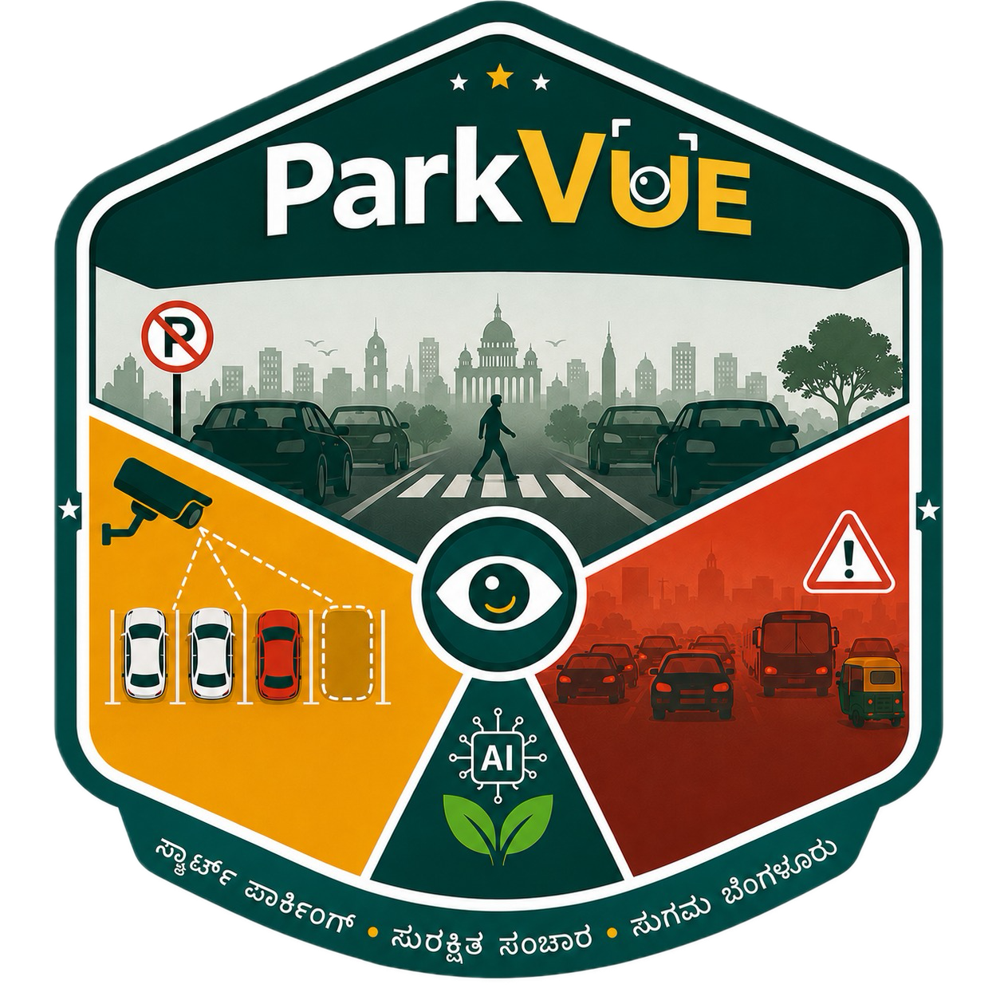
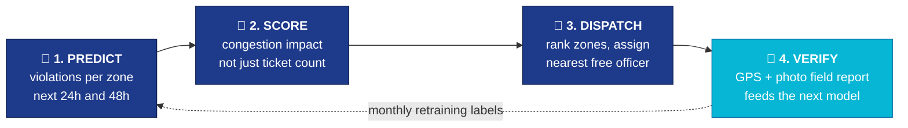
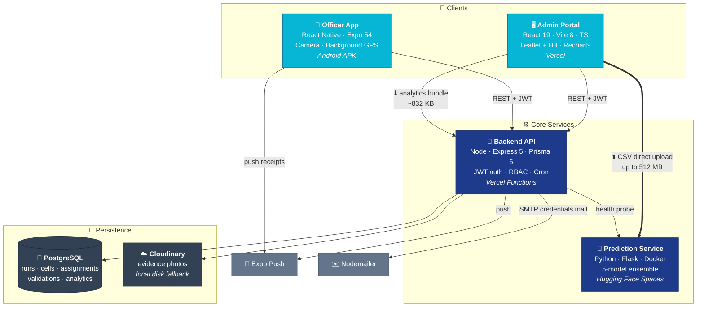
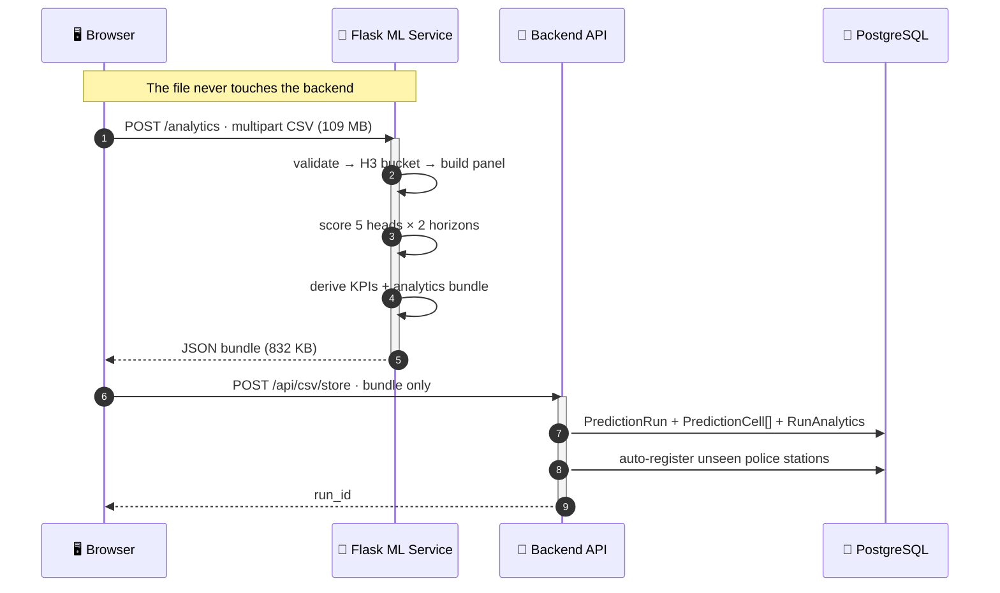
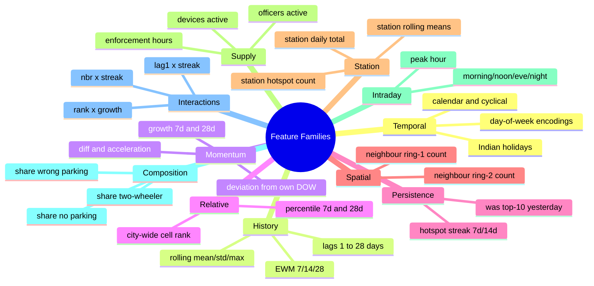
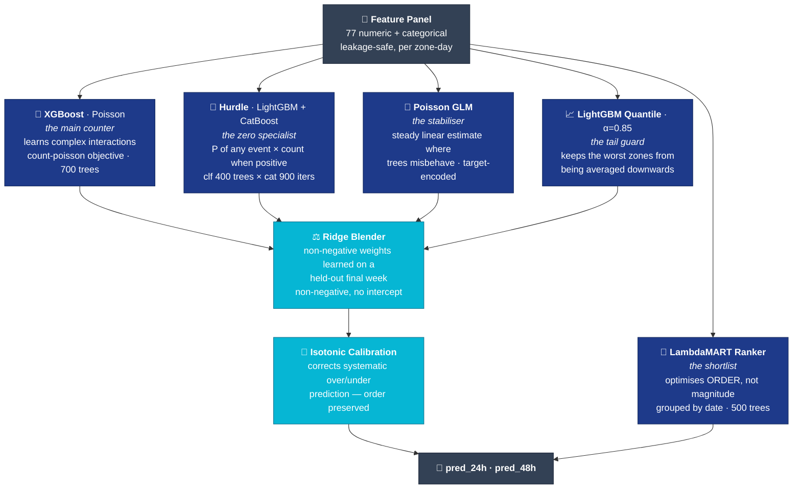
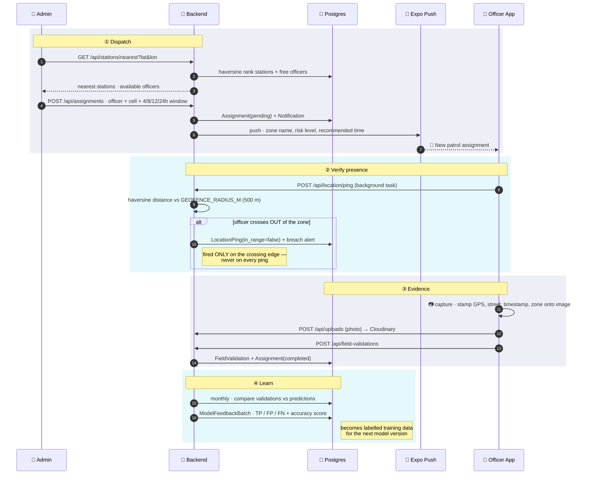
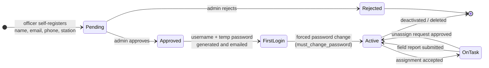
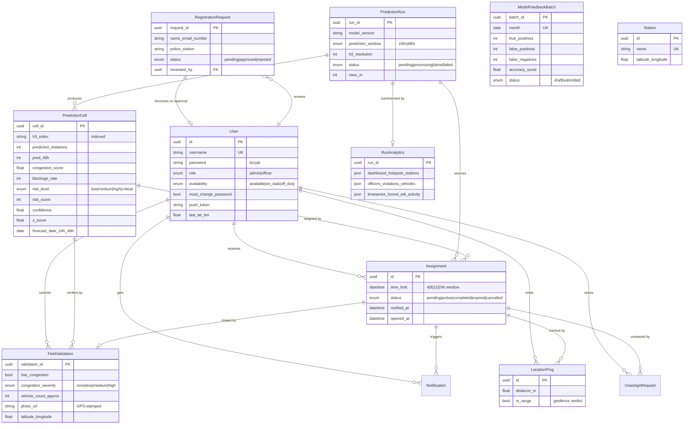

<div align="center">



# ParkVUE

### Predicting illegal parking **before** it blocks the road.

*A city does not always run out of road space. Very often, the road is still there — it is just parked on.*

<br/>

[](https://parkvue-codingbits.vercel.app)
[](https://medium.com/@zenishadevani/how-we-built-parkvue-predicting-illegal-parking-before-it-blocks-the-road-7128054d6745)
[](#-the-team)

<br/>


</div>

---

<div align="center">

|  |  |  |  |
|:--:|:--:|:--:|:--:|
| **2,98,450** | **661** | **0.688** | **147s** |
| real violation records | patrol zones modelled | precision @ top-10 | full-dataset run |

</div>

---

## 📑 Table of Contents

<table>
<tr>
<td valign="top">

**Understanding**
1. [The Problem](#-the-problem)
2. [What ParkVUE Does](#-what-parkvue-does)
3. [System Architecture](#-system-architecture)
4. [Tech Stack](#-tech-stack)

</td>
<td valign="top">

**The Intelligence**

5. [The Data](#-the-data)
6. [Patrol Zones with H3](#-dividing-the-city-into-patrol-zones)
7. [Feature Engineering](#-feature-engineering)
8. [The Five-Model Ensemble](#-the-five-model-ensemble)
9. [Congestion Impact Score](#-congestion-impact-score)
10. [Explainability](#-explainability--xai)
11. [Results](#-results)

</td>
<td valign="top">

**The Product**

12. [Prediction → Action](#-from-prediction-to-action)
13. [Repository Layout](#-repository-layout)
14. [Data Model](#-data-model)
15. [API Reference](#-api-reference)
16. [Getting Started](#-getting-started)
17. [Configuration](#-configuration)
18. [Deployment](#-deployment)
19. [Roadmap](#-roadmap)
20. [The Team](#-the-team)

</td>
</tr>
</table>

---

## 🚧 The Problem

Most Indian cities fight traffic jams by **building more road** — flyovers, corridor widening, signal upgrades. These cost crores and take years. All of them rest on one assumption: *the city has run out of road space.*

Very often it has not. The road is still there. It is simply **parked on**.

```
┌─────────────────────────────────────────────────────┐
│  DESIGNED CAPACITY          →  3 lanes              │
├─────────────────────────────────────────────────────┤
│  🚗🏍️🏍️🚗  parked on side lane                       │
│  ══════════════════════════  lane 2  ↓              │
│  ══════════════════════════  lane 3  ↓              │
├─────────────────────────────────────────────────────┤
│  EFFECTIVE CAPACITY         →  2 lanes              │
│  RESULT                     →  queue spreads back   │
│                                to junctions 100s    │
│                                of metres away       │
└─────────────────────────────────────────────────────┘
```

This happens every single day outside markets, hospitals, metro stations and commercial complexes. A small number of wrongly parked vehicles can slow an entire road.

So illegal parking is **not a small civic problem** — it is a daily, repeating loss of road space. And unlike a flyover, reversing it costs almost nothing.

### The gap nobody was closing

> [!IMPORTANT]
> Traffic departments **already have** the data to fix this. Every digital challan records location, time, vehicle type, violation type and the police station in charge. Over a few months this becomes lakhs of records showing exactly where the city gets blocked, and at what hour.

But that data is used to look **backwards** — count revenue, file the monthly report, archive. It almost never answers the one question that matters operationally:

> **"Where should my officers be standing tomorrow morning?"**

Because of that, enforcement always arrives *after* the damage. A patrol is dispatched only after a complaint, or after the jam has already formed — by which point clearing it costs far more effort than preventing it would have.

Meanwhile a large city has dozens of police stations and hundreds of busy junctions, but only a limited number of officers on any given shift. **Nobody hands those officers a ranked list of where their time will matter most.**

That is the gap ParkVUE closes.

---

## ✨ What ParkVUE Does

ParkVUE is a **complete parking intelligence system** — not a model, a *loop*. It does four things, in order, and then feeds the result back into step one.



| Step | What happens | Why it matters |
|:--|:--|:--|
| **1 · Predict** | Forecast how many violations each city zone will see over the next **24h** and **48h** | Turns an archive into a forecast |
| **2 · Score** | Convert counts into a **congestion impact score** measuring how badly a zone will *block traffic* | A scooter in a bay ≠ a goods vehicle double-parked at 10 AM |
| **3 · Dispatch** | Rank zones, find the nearest station with free officers, assign with a patrol window, push a notification | A ranked list is useless if it never reaches a person |
| **4 · Verify** | Officer submits severity, vehicle mix, count, notes and a **GPS-stamped photo**; monthly comparison against predictions | The system learns from the very enforcement it directs |

> [!NOTE]
> The important part is that **the system does not stop at prediction**. It also assigns the work, checks the work was done, and learns from the result. That closed loop is the whole design.

---

## 🏛 System Architecture

Four independently deployable services — which also let all four of us build in parallel without blocking each other.



### 🔑 The one architectural decision worth explaining

> [!WARNING]
> **Serverless hosts cap request bodies at a few megabytes. A real city violation dataset is 100 MB+.**

Routing the CSV through the backend would have made the whole system undeployable. So we don't.



**Result:** a 109 MB dataset produces an 832 KB summary. Everything stays inside platform limits while still supporting uploads up to **512 MB**.

---

## 🧰 Tech Stack

<table>
<tr><th align="left" width="180">Service</th><th align="left">Stack</th><th align="left" width="90">Port</th><th align="left">Lines</th></tr>

<tr>
<td valign="top"><b>🖥️ Admin Portal</b><br/><code>client/</code></td>
<td>

`React 19` · `TypeScript 6` · `Vite 8` · `Tailwind 3`
`Framer Motion 12` · `React Router 7` · `Recharts 3`
`Leaflet 1.9` + `React-Leaflet 5` · `H3-JS 4` · `Sonner` · `Lucide`

</td>
<td valign="top"><code>5173</code></td>
<td valign="top">~10.9k</td>
</tr>

<tr>
<td valign="top"><b>🔌 Backend API</b><br/><code>server/</code></td>
<td>

`Node 20` · `Express 5` · `TypeScript 6` · `Prisma 6` · `PostgreSQL`
`Zod 4` (validation) · `jsonwebtoken` · `bcryptjs` · `Helmet` · `Morgan`
`Multer` · `Cloudinary` · `Nodemailer` · `expo-server-sdk` · `node-cron` · `h3-js`

</td>
<td valign="top"><code>4000</code></td>
<td valign="top">~3.5k</td>
</tr>

<tr>
<td valign="top"><b>🧠 Prediction Service</b><br/><code>model/</code></td>
<td>

`Python` · `Flask` · `Gunicorn` · `Docker`
`XGBoost` · `LightGBM` · `CatBoost` · `scikit-learn`
`pandas` · `numpy` · `h3` · `holidays` · `joblib` · `SHAP`

</td>
<td valign="top"><code>8077</code></td>
<td valign="top">~1.5k</td>
</tr>

<tr>
<td valign="top"><b>📱 Officer App</b><br/><code>mobile/</code></td>
<td>

`React Native 0.81` · `Expo 54` · `Expo Router 6` · `TanStack Query 5`
`expo-camera` · `expo-location` + `expo-task-manager` (background GPS)
`expo-notifications` · `expo-secure-store` · `react-native-webview` (map)

</td>
<td valign="top"><code>8081</code></td>
<td valign="top">~4.4k</td>
</tr>
</table>

---

## 📊 The Data

Built and tested on **2,98,450 real parking violation records** from a metropolitan traffic police department — real enforcement data, not simulated.

<div align="center">

| Coverage | Value |
|:--|:--|
| 📅 **Period** | 10 Nov 2023 → 8 Apr 2024 · **151 days** |
| 🏢 **Police stations** | **54** station areas |
| 📍 **Geo validity** | **99.94%** of records inside the city boundary |
| ⚠️ **Data quality gap** | **42%** of records have no review status recorded |

</div>

### What the data told us

<table>
<tr>
<td width="33%" valign="top">

#### ⏰ Concentrated in time
Violations peak **8 AM – 12 noon**.

| Hour | Records |
|:--|--:|
| 10 AM | 32,580 |
| 11 AM | 32,176 |

</td>
<td width="33%" valign="top">

#### 📍 Concentrated in space
The **5 busiest** station areas produce **> 41%** of all records in the city.

</td>
<td width="33%" valign="top">

#### 📆 Weak weekly rhythm
| Day | Records |
|:--|--:|
| Sunday *(peak)* | 50,162 |
| Monday *(low)* | 34,680 |

Matches weekend shopping and leisure travel.

</td>
</tr>
</table>

#### Two violation types dominate everything

```
WRONG PARKING   ████████████████████████████████████████████  1,47,493
NO PARKING      ██████████████████████████████████████        1,28,624
all others      ███                                            ~22,333
                └─────────────────────────────────────────────────────
                 these two = >92% of all violations
```

Scooters and cars together account for **~62%** of vehicles involved.

> [!IMPORTANT]
> **The most important lesson was statistical, not descriptive.** Most locations have **no** violations on most days, while a few have very many. This is *sparse count data* — and it shaped almost every modelling decision that follows.

---

## 🔷 Dividing the City Into Patrol Zones

A latitude/longitude pair is not somewhere you can send an officer.

- Two violations recorded **30 m apart on the same road** are the same problem — they must be counted together.
- Administrative areas (wards, station boundaries) are **far too large** to guide a patrol team.

We solved this with **Uber's H3** hexagonal grid at **resolution 9**.

<div align="center">

| Property | Value |
|:--|:--|
| Cell area | **≈ 0.1 km²** |
| Edge length | **≈ 174 m** |
| Real-world equivalent | roughly **one city block** — an area one officer can actually watch |

</div>

### Why hexagons, not squares

```
        SQUARE GRID                      HEXAGON GRID
   ┌─────┬─────┬─────┐                  ⬡     ⬡
   │  d  │  e  │  d  │                     ⬡ ⬡ ⬡
   ├─────┼─────┼─────┤                  ⬡  ⬡ ◉ ⬡  ⬡
   │  e  │  ◉  │  e  │                     ⬡ ⬡ ⬡
   ├─────┼─────┼─────┤                  ⬡     ⬡
   │  d  │  e  │  d  │
   └─────┴─────┴─────┘                  6 neighbours
                                        ALL at equal distance
   8 neighbours, TWO distances
   edge (e) ≠ diagonal (d)              → spatial spread modelling
                                          is even and unbiased
```

Every hexagon has exactly **six** neighbours, all at the **same** distance from the centre. A square has four edge-neighbours and four corner-neighbours that are further away. Because hexagons are even in every direction, modelling how congestion *spreads* from one zone into surrounding zones becomes both easier and more accurate.

### The modelling threshold

Records are grouped into a table of **one row per zone per day**. Zones with too little history cannot support a reliable prediction, so we keep only those with **≥ 50 recorded events**.

<div align="center">

```
2,517 H3 zones appeared in the dataset
        ↓  filter: ≥ 50 events
  661 zones modelled  ·  26% of zones, the operationally meaningful ones
```

</div>

*Configured in `model/features_v6.py` — `H3_RES = 9`, `MIN_CELL_EVENTS = 50`, coverage bbox `lat 12.7–13.2 / lon 77.3–77.9`.*

---

## 🧬 Feature Engineering

From the zone-day panel we build **~100 features** across **13 categories** — 77 numeric plus categorical station / junction / centre encodings.



### Two families worth explaining properly

<table>
<tr>
<td width="50%" valign="top">

#### 🔁 Hotspot Persistence

We track whether a zone was among the **worst in the city yesterday**, and how many days in a row it has been bad.

`was_top10_lag1` · `was_top10_lag3` · `was_top10_lag7`
`hotspot_streak_7d` · `hotspot_streak_14d` · `top_rank_pct_lag1`

**Why it matters:** it lets the model separate a zone that is *always* a problem from one that simply had an unusual day.

> A location that is bad **every Tuesday** needs a permanent patrol.
> A **single-day spike** needs nothing at all.

</td>
<td width="50%" valign="top">

#### 🎯 Enforcement Supply — *the hidden trap*

Violation records do not measure violations. **They measure enforcement.**

If a location has no recorded violations, either it genuinely has no problem — **or officers never go there**.

`dev_lag1` · `off_lag1` · `hours_lag1`
`dev_roll7` · `off_roll7` · `hours_roll7` · `evt_per_dev_lag1`

By counting how many *devices, officers and enforcement hours* were active per area, the model can partly tell those two cases apart.

> [!CAUTION]
> Without this, the model learns that unpatrolled areas are safe, recommends nobody visits them, and **preserves its own blind spot forever.**

</td>
</tr>
</table>

### 🚨 The one rule we never broke

> **Every feature must use only information genuinely available *before* the day being predicted.**

A 7-day average for a Monday uses the seven days *before* that Monday — never the Monday itself. This sounds obvious and is extremely easy to get wrong. Break it and your model looks excellent in testing, then fails completely in production, because the future information it learned to lean on does not exist yet.

**How we guaranteed it:** the trainer and the live inference service import **the exact same feature module**.

```
model/features_v6.py
        ├──→ imported by  train_production_v6.py   (training)
        └──→ imported by  app.py                   (serving)

  one copy of the code → training and production can never drift apart
```

---

## 🤖 The Five-Model Ensemble

The target — violation count per zone, next day and day after — is hard for **three reasons at once**:

<div align="center">

| # | Property | Breaks |
|:--:|:--|:--|
| 1 | Values are **whole numbers, never negative** | plain regression |
| 2 | **Most values are zero** | mean-fitting models |
| 3 | A few zones sit **far above the average** | anything that averages the tail down |

</div>

No single model handles all three. So we train five per horizon and combine them.



<details>
<summary><b>📖 Why each head exists — click to expand</b></summary>

<br/>

| Head | Model | Job |
|:--|:--|:--|
| **Counter** | `XGBoost` with a **Poisson objective** | Does the main counting work and learns the complex relationships between features. Poisson because counts are non-negative integers. |
| **Hurdle** | `LightGBM` classifier **×** `CatBoost` Poisson regressor | Splits the problem into two smaller questions: *will anything happen at all?* then *how much?* The classifier trains on all rows; the regressor trains **only on positives**. This is what handles the mass of zeros properly — a single model cannot do this nearly as well. |
| **Stabiliser** | `Poisson GLM` on standardised, target-encoded features | Adds a simple, steady linear estimate. Keeps the blend sane in regions where tree models behave badly (sparse leaves, unseen categories). |
| **Tail guard** | `LightGBM` **quantile α = 0.85** | Deliberately tuned at the high end. Its job is to make sure the worst zones do not get averaged downwards by the other three. |
| **Blender** | `Ridge`, `positive=True`, `fit_intercept=False` | Learns the mixing weights from a held-out final week. Non-negativity stops any single head dominating **and** guarantees the output can never be negative. Falls back to `[0.25, 0.45, 0.15, 0.15]` when the validation slice is too small. |
| **Ranker** | `LambdaMART` (`LGBMRanker`, `lambdarank`) | Separate model, one job: **get the order right**. A police department works from a ranked shortlist, not from exact counts. Grouped by date so it learns within-day ordering. |

**Training window:** most recent **12 weeks**, so the production model reflects current city behaviour.
**Hyperparameters:** tuned via an Optuna run, frozen in `BEST` inside `train_production_v6.py`.
**Artefact:** everything — 5 heads × 2 horizons, GLM scalers, encode maps, blend weights, severity quantiles, attribute maps — pickles into a single `production_v6.pkl`.

</details>

Finally, **isotonic calibration** corrects any consistent tendency to predict too high or too low — without changing the ordering of zones.

---

## 🚦 Congestion Impact Score

> **If we only count violations, we treat every violation as equally serious. That is clearly wrong.**

A scooter parked in a marked bay causes almost no disruption. A goods vehicle double-parked on a main road at 10 AM can block an entire corridor.

So we weight the predicted count by how much the violations at that location *actually obstruct traffic*.

### Blockage rate — the obstructing categories

```
🚫 PARKING IN A MAIN ROAD                        🚫 PARKING ON FOOTPATH
🚫 PARKING NEAR ROAD CROSSING                    🚫 DOUBLE PARKING
🚫 PARKING NEAR TRAFFIC LIGHT OR ZEBRA CROSS     🚫 PARKING NEAR BUSTOP/SCHOOL/HOSPITAL
🚫 PARKING OPPOSITE TO ANOTHER PARKED VEHICLE
```

`blockage_rate` = share of a zone's violations belonging to these categories.

### Four-wheeler share — road space consumed

`CAR` · `LGV` · `MAXI-CAB` · `PRIVATE BUS` · `VAN` · `TEMPO` · `BUS (BMTC/KSRTC)` · `GOODS AUTO`

These occupy far more road space than two-wheelers.

### The formula

```python
congestion_raw   = pred_24h × (1 + blockage_rate/100) × (1 + four_wheeler_share)
congestion_score = percentile_rank(congestion_raw) × 100        # 0–100
```

<div align="center">

**A zone with fewer but more obstructive violations correctly outranks a zone with many harmless ones.**

</div>

> [!TIP]
> This score is what changes the conversation with a city. It turns a *parking enforcement number* into a **road capacity number** — and road capacity is the language cities use when they plan budgets.

### Risk score and confidence

```python
# risk: volume percentile, amplified by persistence and growth
risk_raw   = pct(pred_24h) × (1 + 0.5·was_top10_lag1
                                + 0.1·clip(streak_7d,0,7)/7
                                + 0.2·clip(growth_7,0,1))
risk_score = pct(risk_raw) × 100

# confidence: ensemble agreement × data density
cv         = std(4 heads) / (mean(4 heads) + 1)
confidence = (1 - normalise(cv)) × min(cell_events / density_p90, 1)
```

Every prediction carries a **confidence** value based on how much the four heads agree *and* how much history that zone has. When the models disagree, or a zone has little past data, confidence drops — so an officer knows which predictions are strong and which are uncertain.

> [!NOTE]
> `confidence` is normalised **within each request** — it is comparable across cells in one response, not across separate uploads.

### The deployment schema

Every scored zone comes back with these 13 fields, sorted by `risk_score` descending:

```csv
h3_id, location, severity, risk_score, pred_24h, pred_48h, dominant_violation,
dominant_vehicle, congestion_score, blockage_rate, confidence,
forecast_date_24h, forecast_date_48h
```

---

## 🎬 From Prediction to Action

> **A ranked list is useless if it never reaches a person who can act on it.** This is where most prediction projects stop. It is where we deliberately kept going.



### The details that make it work in the field

<table>
<tr>
<td width="50%" valign="top">

#### 📍 Geofencing, done quietly

The mobile app posts the device location at intervals while an assignment is active — via `expo-task-manager`, so it survives backgrounding on a real build. The backend measures haversine distance from the assigned cell and raises an alert past **500 m** *(configurable via `GEOFENCE_RADIUS_M`)*.

> [!IMPORTANT]
> **The alert fires only at the moment the officer crosses out of the zone — not on every location update.**
>
> A system that alerts continuously is a system people switch off.

*Expo Go has no background location, so the app detects it and falls back to foreground pings — a development build gets the real thing.*

</td>
<td width="50%" valign="top">

#### 📸 Evidence that explains itself

The field report records congestion severity, dominant vehicle type, approximate vehicle count, free-text notes and a photo captured **inside the app**.

The image is stamped in-frame with:

```
┌──────────────────────────┐
│                          │
│      [ photograph ]      │
│                          │
│ 12.9716° N, 77.5946° E   │
│ MG Road, Bengaluru       │
│ 19 Aug 2026 · 10:42 IST  │
│ Zone 8928308280fffff     │
└──────────────────────────┘
```

So the evidence explains itself, and cannot easily be reused somewhere else.

</td>
</tr>
</table>

#### ⏰ Overdue reminders — safe under an unreliable scheduler

Active assignments past `time_limit` with no submitted report get a mail + push nudge. Vercel Cron delivery is best-effort — a run can be missed *or invoked twice* — so each assignment is **claimed inside a transaction**, with the notification row doubling as the dedupe marker, before any mail goes out. A duplicate invocation cannot double-nudge the same officer.

#### 👮 Officer lifecycle



> [!NOTE]
> The temp password is **always** returned to the admin in the API response, not only on mail success — so a broken SMTP config never strands a new officer. The admin can relay credentials by hand.

---

## 🔍 Explainability — XAI

> **A system that decides where police officers go cannot be a black box.** Enforcement carries legal and public responsibility, and an unexplained risk score is not something a senior officer can defend to anyone.

We use **SHAP** (SHapley Additive exPlanations). SHAP attributes how much each feature contributed to a specific prediction, with one very useful mathematical property:

```
      Σ (all feature contributions)  ≡  prediction − average prediction
                                 ↑
              exact, not approximate — this is what makes the
              explanation trustworthy rather than a rough guess
```

### What the global picture confirms

<table>
<tr>
<td width="50%" valign="top">

**The strongest drivers are:**

1. 🥇 **28-day weighted average** (`ewm_28`)
2. 🥈 **Zone rank within the city** (`cell_rank`)

Long-term repeated activity is the main thing driving predictions — exactly what enforcement planning needs.

> A model driven mostly by short-term noise would send officers chasing yesterday's unusual events instead of real recurring problems.

</td>
<td width="50%" valign="top">

**The spread of importance is reassuring:**

```
to reach 80% of total explanation → 24 of 78 features
to reach 95% of total explanation → 48 of 78 features
```

The model is using **a wide range of evidence**, not depending on one or two shortcuts.

</td>
</tr>
</table>

### Zone-level explanations answer the questions an officer actually asks

| Question | Where it's answered |
|:--|:--|
| Is this zone behaving unusually compared with **its own history**? | z-score vs the zone's own baseline |
| **Why** was it placed at this position in the list? | ranked SHAP-style driver contributions |
| What is likely to happen if **nobody is sent** there? | 24h / 48h forecast + severity band |
| Which **nearby zones** could be affected if this is left alone? | neighbour ring-1 / ring-2 activity |

Surfaced in the portal at **Congestion Impact** → EDI explanation panels, served by `GET /api/edi/explanations`.

### The system watches itself

A **PSI (Population Stability Index)** score is computed for every uploaded dataset, checking whether the city's behaviour has drifted from the data the model was trained on. Drift past threshold → the portal warns that the model should be retrained.

<details>
<summary><b>🖼 The full SHAP analysis suite — 14 generated artefacts</b></summary>

<br/>

Generated by `model/shap/run_shap_testing.py`, with the executed notebook committed at `model/shap/shap_testing_executed.ipynb`.

| # | Artefact | What it shows |
|:--:|:--|:--|
| 1 | `shap_beeswarm_summary.png` | Per-feature value vs impact across all zones |
| 2 | `shap_feature_importance_bar.png` | Mean absolute SHAP ranking |
| 3 | `shap_dependence_scatter.png` | How impact varies with feature value |
| 4 | `shap_waterfall_highrisk.png` | Single high-risk zone, decomposed |
| 5 | `shap_force_plot.png` | Push/pull forces on one prediction |
| 6 | `shap_heatmap.png` | Zone × feature contribution matrix |
| 7 | `shap_decision_plot.png` | Cumulative path from base value to prediction |
| 8 | `shap_violin_plot.png` | Contribution distribution per feature |
| 9 | `xai_method_comparison.png` | SHAP vs alternative attribution methods |
| 10 | `partial_dependence_plots.png` | Marginal effect curves |
| 11 | `cohort_shap_comparison.png` | Drivers by zone cohort |
| 12 | `feature_interaction_matrix.png` | Pairwise interaction strength |
| 13 | `shap_directional_impact.png` | Which features push risk up vs down |
| 14 | `cumulative_importance_pareto.png` | The 24-of-78 / 48-of-78 Pareto curve |

</details>

---

## 📈 Results

Validated two ways — a single time-based split **and** 10-fold cross-validation, to confirm the numbers were not one lucky partition.

### Count accuracy

<div align="center">

| Horizon | MAE (before calibration) | MAE (after calibration) |
|:--|:--:|:--:|
| **24 h** | 2.566 | **2.481** ✅ |
| **48 h** | — | **2.630** |

*violations per zone per day*

</div>

In plain terms: for a zone of about **0.1 km²**, the prediction is usually within **two to three violations** of what actually happens. That is accurate enough to separate a zone that needs a patrol from a zone that does not.

### Ranking quality — *what actually matters*

A police department works from a shortlist, so ordering matters more than magnitude.

<div align="center">

| Metric | Value | Reading |
|:--|:--:|:--|
| **Precision @ 10** | **0.688** | Of the 10 zones flagged as tomorrow's worst, **~7 genuinely are** among the city's worst |
| **Specificity @ 10** | **0.995** | The model is **selective** — it is not carpet-flagging zones as risky |
| **Precision @ 10** *(10-fold CV)* | **0.6777 ± 0.0516** | Very close to the single split → **consistent across time periods** |

</div>

### End-to-end production run

The complete dataset pushed through the live system, start to finish:

```
📥  2,98,450 records uploaded
     ↓  validation + geographic filtering
✅  2,98,277 records used            →  0.06% loss
     ↓  H3 bucketing + panel build + 5-head × 2-horizon scoring
🎯  661 zones predicted              →  ~1,800 expected violations
⏱️  147 seconds, complete run
```

### Output balance — a usable shortlist, not an alert flood

<div align="center">

| Severity | Zones | Share |
|:--|--:|:--|
| 🔴 **Critical** | 16 | `██` **2.4%** |
| 🟠 **High** | 184 | `████████████████████████` 27.8% |
| 🟡 **Medium** | 461 | `████████████████████████████████████████████████████████████` 69.7% |

</div>

> [!TIP]
> Only **2.4%** of zones reach the top level. That is exactly what an operations team needs — a short, actionable list instead of a long list of alerts nobody has time to work through.

---

## 📁 Repository Layout

```
SmartAIThon/
│
├── 🧠 model/                          Python · Flask · Docker  →  :8077
│   ├── features_v6.py                 ⭐ SHARED feature pipeline — imported by
│   │                                     BOTH trainer and server (parity guarantee)
│   ├── train_production_v6.py         fits the full ensemble → production_v6.pkl
│   ├── app.py                         Flask service: /predict /validate /analytics /health
│   ├── analytics_v6.py                dashboard bundle: hotspots, timeseries, funnel,
│   │                                     stations, officers, PSI drift, EDI explanations
│   ├── production_v6.pkl              trained bundle (~45 MB, Git LFS)
│   ├── make_stations.py               station master builder
│   ├── make_seed_upload.py            demo seed CSV generator
│   ├── Dockerfile                     Hugging Face Spaces deployment
│   └── shap/                          14 XAI artefacts + executed notebook
│
├── 🔌 server/                         Node · Express 5 · Prisma 6  →  :4000
│   ├── src/
│   │   ├── app.ts                     CORS policy, helmet, routers, deep health probe
│   │   ├── config/env.ts              Zod-validated env — fails loud with named vars
│   │   ├── middleware/                auth (JWT + RBAC) · validate (Zod) · error
│   │   ├── jobs/reminders.ts          overdue-patrol sweep, transaction-claimed
│   │   ├── lib/                       prisma · pyClient · localStorage fallback
│   │   ├── utils/                     jwt · password · geo (haversine) · csv · email · push
│   │   └── modules/                   ← 16 feature modules, each router+controller+service+schema
│   │       ├── auth/                  register · login · me · change-password
│   │       ├── registrationRequests/  officer approval queue + credential mail
│   │       ├── users/                 profile, push token, admin user management
│   │       ├── stations/              master list · nearest-by-haversine · free officers
│   │       ├── csvUpload/             direct-upload bundle store + station auto-sync
│   │       ├── predictionRuns/        run lifecycle + cell ingestion
│   │       ├── predictionCells/       per-zone forecast reads
│   │       ├── assignments/           create · cancel · officer's own list
│   │       ├── unassignRequests/      officer-initiated release, admin reviewed
│   │       ├── location/              GPS ping + geofence breach detection
│   │       ├── fieldValidations/      officer reports + admin stats
│   │       ├── modelFeedbackBatches/  monthly TP/FP/FN accuracy batches
│   │       ├── notifications/         in-app feed
│   │       ├── uploads/               Cloudinary, local-disk fallback
│   │       ├── analytics/             dashboard, hotspots, timeseries, funnel, EDI
│   │       └── jobs/                  cron-secret protected reminder trigger
│   ├── prisma/
│   │   ├── schema.prisma              13 models · 10 enums
│   │   ├── seed.ts                    admin/admin123 + officer/officer123
│   │   ├── seed_stations.ts           station master from stations_seed.json
│   │   └── reset_*.ts                 controlled resets that preserve admin/stations
│   └── api/index.ts                   Vercel serverless entry
│
├── 🖥️ client/                         React 19 · Vite 8 · Tailwind  →  :5173
│   └── src/
│       ├── pages/
│       │   ├── Landing.tsx            public hero + APK download modal
│       │   ├── Login.tsx
│       │   ├── Dashboard.tsx          KPI tiles, live activity, run summary
│       │   ├── Hotspots.tsx           🗺️ Leaflet + H3 hexagon risk map
│       │   ├── Congestion.tsx         impact scoring + EDI explanation panels
│       │   ├── Analytics.tsx          timeseries, funnel, violation/vehicle mix
│       │   ├── OfficerManagement.tsx  approvals, assignment, unassign review
│       │   ├── FieldReports.tsx       officer evidence + validation stats
│       │   ├── CSVUpload.tsx          ⬆️ direct-to-model upload + run history
│       │   └── Profile.tsx
│       ├── components/layout/         AppShell · Sidebar · Topbar · PageTransition
│       ├── components/ui/             Button · Card · Dialog · Badge · RiskBadge
│       │                                StatCard · Skeleton · Toggle · Tooltip
│       ├── config/api.ts              URL normalisation, endpoint map, live/mock switch
│       ├── lib/                       api client · auth context · utils
│       ├── hooks/                     useMockData · useTheme · useMediaQuery
│       └── mocks/                     12 JSON fixtures — portal runs with no backend
│
├── 📱 mobile/                         React Native 0.81 · Expo 54  →  :8081
│   └── src/
│       ├── app/                       Expo Router file-based routes
│       │   ├── (auth)/                login · register · forced change-password
│       │   ├── (tabs)/                Patrol · Notifications · Profile
│       │   └── assignment/[id]/       detail + validate (camera evidence)
│       ├── components/                PatrolMap (WebView + .web variant)
│       │                                AssignmentCard · RiskBadge · SegmentedSlider …
│       └── lib/                       api · auth · queries (TanStack)
│                                        geofence (background task) · push · theme
│
├── dev-local.sh                       starts model + server + client together
└── RUN_LOCAL.md                       detailed local-setup walkthrough
```

---

## 🗄 Data Model

**13 models, 10 enums**, PostgreSQL via Prisma 6.



---

## 🔌 API Reference

**Base:** `http://localhost:4000/api` · **Auth:** `Authorization: Bearer <jwt>`

<details open>
<summary><b>🔐 Authentication</b></summary>

| Method | Path | Access | Description |
|:--|:--|:--|:--|
| `POST` | `/auth/register` | public | Officer submits a registration request |
| `POST` | `/auth/login` | public | `{ username, password }` → `{ token, user }` |
| `GET` | `/auth/me` | any | Current authenticated user |
| `POST` | `/auth/change-password` | any | Forced on first login |

</details>

<details>
<summary><b>👮 Officers & Registration</b></summary>

| Method | Path | Access | Description |
|:--|:--|:--|:--|
| `GET` | `/registration-requests` | admin | Pending approval queue |
| `GET` | `/registration-requests/:id` | admin | Single request |
| `POST` | `/registration-requests/:id/approve` | admin | Creates user, generates credentials, mails them |
| `POST` | `/registration-requests/:id/reject` | admin | Rejects the request |
| `GET` | `/officers` | admin | All officers |
| `GET` | `/officers/pending` | admin | Awaiting approval |
| `POST` | `/officers/approve/:id` | admin | Approve |
| `POST` | `/officers/reject/:id` | admin | Reject |
| `POST` | `/officers/assign` | admin | Assign an officer to a cell |
| `DELETE` | `/officers/:id` | admin | Remove an officer |
| `GET` `PATCH` | `/users`, `/users/:id` | admin | User management |
| `PATCH` | `/users/me` | any | Update own profile |
| `POST` | `/users/me/push-token` | officer | Register the Expo push token |

</details>

<details>
<summary><b>🧠 Predictions & CSV Pipeline</b></summary>

| Method | Path | Access | Description |
|:--|:--|:--|:--|
| `POST` | `/csv` | admin | Upload CSV **through** the backend (small files) |
| `POST` | `/csv/store` | admin | ⭐ Store the analytics bundle from a **direct** browser→model upload |
| `GET` | `/csv/history` | any | Past upload runs |
| `POST` `GET` | `/prediction-runs` | admin | Create / list runs |
| `GET` | `/prediction-runs/:id` | any | Run detail |
| `POST` | `/prediction-runs/:id/ingest` | admin | Ingest scored cells |
| `GET` | `/prediction-cells` | any | Forecast cells, filterable |
| `GET` | `/prediction-cells/:id` | any | Single zone forecast |

</details>

<details>
<summary><b>📋 Assignments & Field Work</b></summary>

| Method | Path | Access | Description |
|:--|:--|:--|:--|
| `POST` | `/assignments` | admin | Create an assignment with a patrol window |
| `GET` | `/assignments` | admin | All assignments |
| `GET` | `/assignments/me` | officer | My patrol list |
| `GET` `PATCH` | `/assignments/:id` | any | Read / update |
| `POST` | `/assignments/:id/cancel` | admin | Cancel |
| `POST` | `/assignments/:id/unassign-request` | officer | Request release, with reason |
| `GET` | `/unassign-requests` | admin | Review queue |
| `POST` | `/unassign-requests/:id/approve` \| `/reject` | admin | Decide |
| `POST` | `/field-validations` | officer | Submit a field report |
| `GET` | `/field-validations` | any | List |
| `GET` | `/field-validations/detailed` | admin | Reports with joins |
| `GET` | `/field-validations/stats` | admin | Aggregate accuracy stats |
| `POST` | `/uploads` | officer | Evidence photo → Cloudinary or local disk |

</details>

<details>
<summary><b>📍 Location, Stations & Notifications</b></summary>

| Method | Path | Access | Description |
|:--|:--|:--|:--|
| `POST` | `/location/ping` | officer | GPS fix; server geofence-checks it |
| `GET` | `/location/breaches` | admin | Geofence breach log |
| `GET` | `/stations/master` | any | Full station list |
| `GET` | `/stations/nearest` | any | Nearest stations to a lat/lon, by haversine |
| `GET` | `/stations/:id/officers` | any | Officers at a station, with availability |
| `GET` | `/notifications` | any | My notification feed |
| `PATCH` | `/notifications/:id/read` | any | Mark read |

</details>

<details>
<summary><b>📊 Analytics & Model Feedback</b></summary>

| Method | Path | Access | Description |
|:--|:--|:--|:--|
| `GET` | `/dashboard` | any | KPI tiles + run summary |
| `GET` | `/hotspots` | any | Ranked zones for the map |
| `GET` | `/stations` | any | Per-station aggregates |
| `GET` | `/timeseries` | any | Monthly / daily / hourly / trend |
| `GET` | `/funnel` | any | Enforcement funnel |
| `GET` | `/violations` \| `/vehicles` | any | Composition breakdowns |
| `GET` | `/edi/explanations` | any | 🔍 Per-zone XAI explanation panels |
| `GET` | `/activity` | any | Live activity feed |
| `POST` | `/model-feedback-batches/generate` | admin | Build the monthly TP/FP/FN batch |
| `GET` | `/model-feedback-batches` | admin | List batches |
| `POST` | `/model-feedback-batches/:id/submit` | admin | Submit for retraining |
| `GET` | `/health` | public | Liveness · `?deep=1` also probes model, SMTP, uploads |

</details>

<details>
<summary><b>🐍 Model Service — <code>:8077</code></b></summary>

<br/>

| Method | Path | Description |
|:--|:--|:--|
| `POST` | `/predict?horizon=24h\|48h\|both&format=csv\|json` | Raw violation CSV in → per-zone forecast out |
| `POST` | `/validate` | Dry-run the upload rules without scoring |
| `POST` | `/analytics` | Full dashboard bundle (what the portal calls directly) |
| `GET` | `/health` | Liveness + bundle info: known cells, horizons, schema |

```bash
curl -F "file=@recent_violations.csv" \
     "http://localhost:8077/predict?horizon=both&format=csv" -o predictions.csv
```

### Upload rules — enforced before scoring

| # | Rule | Failure message |
|:--:|:--|:--|
| 1 | Parses as CSV with a header; filename ends `.csv` | `not a .csv file` / `cannot parse CSV` |
| 2 | All **11 required columns** present | `missing required columns: [...]` |
| 3 | **≥ 50** data rows | `only N rows; need >= 50` |
| 4 | **≥ 50%** rows with numeric lat/lon **and** parseable `created_datetime` | `latitude/longitude mostly non-numeric` |
| 5 | **≥ 50** rows inside the coverage bbox `lat 12.7–13.2, lon 77.3–77.9` | `only N rows inside coverage bbox` |
| 6 | **≥ 8** distinct dates *(needed for lag/rolling features)* | `only N distinct dates; need >= 8` |
| 7 | **≥ 1** H3 cell reaching 50 events | `no H3 cell reaches the 50-event threshold` |

**Required columns:**

```
latitude · longitude · created_datetime · police_station · violation_type
vehicle_type · device_id · created_by_id · junction_name · center_code · location
```

Extra columns are ignored — the full 24-column export works as-is.

**Non-blocking warnings** *(returned in `warnings[]` and the `X-Validation-Warnings` header)*:
- `< 28 distinct dates` → recommend ≥ 28 for stable features
- `> 30%` of rows dropped by geo/date filtering → check coordinates and timestamps

**Format notes:** `created_datetime` is an ISO UTC timestamp; `violation_type` is a JSON-array string like `["WRONG PARKING"]`; lat/lon numeric. Predictions are for the day **after** the latest `created_datetime`.

</details>

---

## 🚀 Getting Started

### Prerequisites

```
Node ≥ 20.19   ·   Python ≥ 3.10   ·   PostgreSQL ≥ 14   ·   Git LFS
```

### ⚡ Quick start — everything at once

```bash
git clone https://github.com/prem-raichura/SmartAIthon-CodingBits.git
cd SmartAIthon-CodingBits
git lfs pull                    # pulls production_v6.pkl (~45 MB)
./dev-local.sh                  # model + API + portal, logs streamed, Ctrl-C stops all
```

### 🔧 Manual — three terminals

<table>
<tr><th align="left">Terminal 1 · 🧠 Prediction Service</th></tr>
<tr><td>

```bash
cd model
pip install -r requirements.txt
python3 train_production_v6.py   # ~3 min, one-time — builds production_v6.pkl
python3 app.py                   # http://localhost:8077
```

Verify: `curl http://localhost:8077/health` → `{"status":"ok", ...}`

> A `503` means `production_v6.pkl` is missing or is still a Git LFS pointer — run `git lfs pull`.

Production: `gunicorn -w 2 -b 0.0.0.0:8077 app:app`

</td></tr>
</table>

<table>
<tr><th align="left">Terminal 2 · 🔌 Backend API</th></tr>
<tr><td>

```bash
createdb officer_app

cd server
npm install
cp .env.example .env             # edit DATABASE_URL to match your Postgres user
npm run migrate                  # apply the schema
npm run seed                     # admin/admin123 + officer/officer123
npm run seed:stations            # optional — load the station master
npm run dev                      # http://localhost:4000
```

Verify:
```bash
curl http://localhost:4000/api/health           # {"status":"ok"}
curl 'http://localhost:4000/api/health?deep=1'  # also probes model service, SMTP, uploads
```

</td></tr>
</table>

<table>
<tr><th align="left">Terminal 3 · 🖥️ Admin Portal</th></tr>
<tr><td>

```bash
cd client
npm install
cp .env.example .env.local
npm run dev                      # http://localhost:5173
```

Sign in with **`admin` / `admin123`**.

> Without `VITE_API_URL` the portal runs in **mock mode** — charts render from `src/mocks/*.json`, but login and uploads need the real API.

</td></tr>
</table>

<table>
<tr><th align="left">Optional · 📱 Officer App</th></tr>
<tr><td>

```bash
cd mobile
npm install
npx expo start                   # scan the QR with Expo Go, or press a / i
```

The app **auto-detects the Metro host's LAN IP** and talks to `http://<that-ip>:4000/api`, so a physical device works with no configuration. To override, create `mobile/.env`:

```env
EXPO_PUBLIC_API_URL=http://192.168.1.10:4000/api
```

Find your IP with `ipconfig getifaddr en0`.

</td></tr>
</table>

### 📲 Building the Android APK

> [!WARNING]
> `EXPO_PUBLIC_*` variables are **inlined at build time**, and a local `.env` is **not** uploaded to EAS. Set the URL in `eas.json` under `build.<profile>.env` **first**.

```bash
cd mobile
npx expo-doctor                          # should report 18/18 checks passed
npx expo export --platform android       # smoke-test that the bundle builds
eas build -p android --profile preview
```

If the installed APK misbehaves, the app renders an on-screen error with the message **and the API URL it was built against** — instead of a white screen.

A prebuilt APK is also downloadable from the [live landing page](https://parkvue-codingbits.vercel.app) → **Download Mobile App**.

---

## ⚙️ Configuration

<details open>
<summary><b>🔌 <code>server/.env</code></b></summary>

| Variable | Default | Purpose |
|:--|:--|:--|
| `DATABASE_URL` | — | **required** · Postgres connection string |
| `JWT_SECRET` | — | **required** · minimum 32 characters |
| `JWT_EXPIRES_IN` | `30d` | Token lifetime |
| `PORT` | `4000` | Listen port |
| `NODE_ENV` | `development` | |
| `CORS_ORIGINS` | localhost set | Comma-separated allowlist *(localhost, LAN and `*.vercel.app` are always allowed)* |
| `JSON_BODY_LIMIT` | `25mb` | Express JSON cap — **lower to `4mb` behind a serverless host** |
| `PY_SERVICE_URL` | `http://localhost:8077` | Flask model service |
| `GEOFENCE_RADIUS_M` | `500` | Breach threshold in metres |
| `REMINDER_CRON` | `*/5 * * * *` | Overdue-patrol sweep schedule |
| `EMAIL_MODE` | `stub` | `stub` prints to console and sends nothing · `smtp` sends for real |
| `SMTP_HOST` `SMTP_PORT` `SMTP_USER` `SMTP_PASS` `SMTP_FROM` | — | Required when `EMAIL_MODE=smtp` |
| `PUSH_MODE` | `stub` | `stub` logs payloads · `expo` delivers via Expo Push |
| `CLOUDINARY_CLOUD_NAME` `_API_KEY` `_API_SECRET` | — | Optional — unset writes photos to `server/uploads/` |
| `PUBLIC_URL` | — | Public origin for absolute local-upload URLs |
| `CRON_SECRET` | — | Lets a platform scheduler trigger the reminder sweep without an admin JWT |

> [!NOTE]
> Env is validated by **Zod at import time**. A missing variable throws immediately and **names the exact variables** in the log — because on Vercel a bad env otherwise surfaces only as `FUNCTION_INVOCATION_FAILED`.

</details>

<details>
<summary><b>🖥️ <code>client/.env.local</code></b></summary>

| Variable | Purpose |
|:--|:--|
| `VITE_API_URL` | Backend base. Auto-normalised: bare host gets `https://`, `http` upgraded to `https` for non-localhost, trailing slash stripped, `/api` appended if missing. **Unset = mock mode.** |
| `VITE_PY_URL` | Flask model service for direct CSV upload. Default `http://localhost:8077` |

</details>

<details>
<summary><b>📱 <code>mobile/.env</code> and <code>eas.json</code></b></summary>

| Variable | Purpose |
|:--|:--|
| `EXPO_PUBLIC_API_URL` | Backend base. Omit locally — the app auto-detects the Metro LAN IP. **Must** be set in `eas.json` for any EAS build. |

</details>

<details>
<summary><b>🧠 Model service</b></summary>

| Variable | Default | Purpose |
|:--|:--|:--|
| `PORT` | `8077` | Listen port |
| `CORS_ORIGINS` | `*` | Comma-separated origins — the browser uploads here directly |

**Tunable constants** in `model/features_v6.py`:

```python
H3_RES           = 9                        # patrol zone size
MIN_CELL_EVENTS  = 50                       # modelling threshold
LAT_MIN, LAT_MAX = 12.7, 13.2               # coverage bbox
LON_MIN, LON_MAX = 77.3, 77.9
MAX_BYTES        = 512 * 1024 * 1024        # upload cap
MIN_DATES_ERROR  = 8                        # hard minimum history
MIN_DATES_WARN   = 28                       # recommended history
TZ               = 'Asia/Kolkata'
```

</details>

---

## ☁️ Deployment

<div align="center">

| Service | Platform | Notes |
|:--|:--|:--|
| 🖥️ **Admin Portal** | **Vercel** | Static Vite build · `client/vercel.json` |
| 🔌 **Backend API** | **Vercel Functions** | `server/api/index.ts` entry · Prisma binary target `rhel-openssl-3.0.x` for the RHEL/OpenSSL 3 runtime |
| 🧠 **Prediction Service** | **Hugging Face Spaces** | Docker SDK · `model/Dockerfile` · `app_port: 8077` |
| 🐘 **Database** | any managed **PostgreSQL** | Prisma driver adapter over `pg` |
| ☁️ **Photos** | **Cloudinary** | Local-disk fallback when unconfigured |
| 📱 **Officer App** | **EAS Build** → Android APK | Distributed from the landing page |

</div>

### Serverless gotchas we hit — and fixed

| Problem | Fix |
|:--|:--|
| Prisma shipped only the local query engine and failed once deployed | `binaryTargets = ["native", "rhel-openssl-3.0.x"]` in `schema.prisma` |
| Request body cap made 100 MB CSV upload impossible | Browser uploads **direct to the model service**; only the 832 KB bundle reaches the backend |
| Function froze on response before the approval email flushed | `await` the send before responding |
| Bad env surfaced only as `FUNCTION_INVOCATION_FAILED` | Zod validation at import, logging the exact missing variable names |
| Vercel Cron can miss a run *or* fire it twice | Transaction-claimed reminders, notification row as dedupe marker |
| Helmet 8's `exports` map has no `types` condition, breaking the Vercel TS build | Defensive `default ?? namespace` resolution in `app.ts` |
| Unknown API paths returned Express' HTML error page, which the client read as silent success | Explicit JSON `404` handler |

---

## 🌏 Built for India, Not Just One City

We tested ParkVUE on data from one city, but **nothing in the system is tied to that city**.

<table>
<tr><td width="50%" valign="top">

✅ The **11 input columns** are standard in Indian e-challan systems
✅ **H3 works anywhere on Earth** with no setup
✅ New police stations found inside an uploaded file are **auto-registered** using their centroid
✅ City boundary, zone size, event threshold, geofence radius and patrol windows are **all settings** — none are hardcoded values

</td><td width="50%" valign="top">

**To deploy in a new city you need exactly two things:**

```
1. a history file of violations
2. a list of police stations
```

The system retrains itself and starts predicting **with no code changes at all**.

> [!IMPORTANT]
> One real requirement: the model needs **≈ 4 weeks of history** before its features become meaningful — and accuracy keeps improving as more history accumulates.

</td></tr>
</table>

---

## 🛣 Roadmap

| | Direction | Why it's interesting |
|:--:|:--|:--|
| **1** | 🚗 **Live traffic speed integration** | Validate the congestion score against *measured* delay, instead of estimating it from violation types |
| **2** | 🕸️ **Congestion propagation modelling** | Show that clearing **one** zone prevents **three others** from getting worse — network effects, not isolated cells |
| **3** | 🏙️ **Multi-city joint training** | Test whether a model learned in one city transfers to a city with little data of its own |

---

## 💭 Final Thoughts

> Indian cities do not only have a problem of not having enough roads. They also have a problem of **not using the roads they already have.** The lanes exist. They are simply occupied by parked vehicles.
>
> What made this project worth building is that the data needed to fix this **already exists** in almost every traffic department in the country. It sits inside challan records, gets counted for revenue, and is then forgotten.
>
> **ParkVUE is our argument that this data is not only a record of what already happened. It can also be a forecast of tomorrow morning — if someone chooses to read it that way.**

---

## 👥 The Team

<div align="center">

### Team T643 · **Coding Bits**

**SmartAIThon 2026**

Department of Computer Engineering
**LDRP Institute of Technology and Research**
Kadi Sarva Vishwavidyalaya, Gandhinagar

<br/>

| 👨‍💻 **Prem Raichura** |
| 👩‍💻 **Charmi Padh** | 
| 👩‍💻 **Zenisha Devani** | 
| 👨‍💻 **Rohan Thakar** | 

<br/>

*The architecture, the model and the mobile application came together only because of the team's effort — and their willingness to rebuild things that were almost working, but not quite right.*

</div>

---

<div align="center">

### 🔗 Links

[**🌐 Live Admin Portal**](https://parkvue-codingbits.vercel.app) · [**📖 The Full Story on Medium**](https://medium.com/@zenishadevani/how-we-built-parkvue-predicting-illegal-parking-before-it-blocks-the-road-7128054d6745) · [**💻 Source**](https://github.com/prem-raichura/SmartAIthon-CodingBits)

<br/>

**Built for SmartAIThon 2026** 🚦

<sub>The bundled dataset and mock fixtures are drawn from a Bengaluru traffic-violations export, so station and junction names reflect that city.</sub>

</div>
